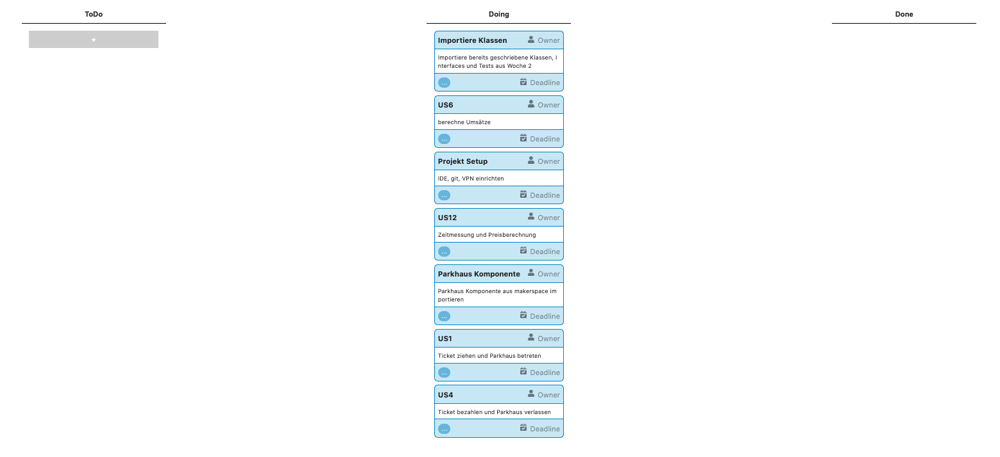
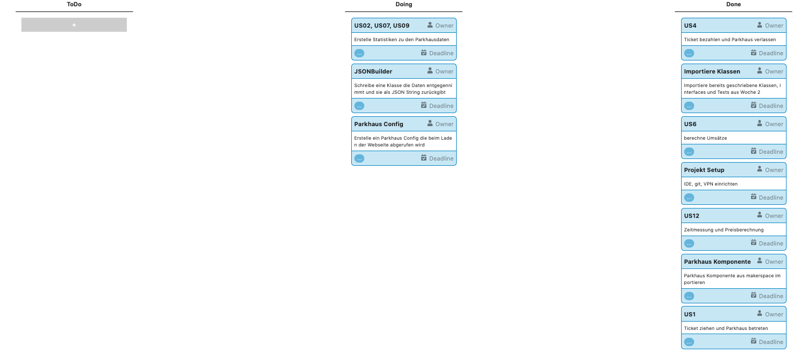
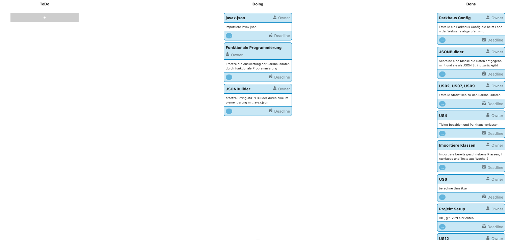
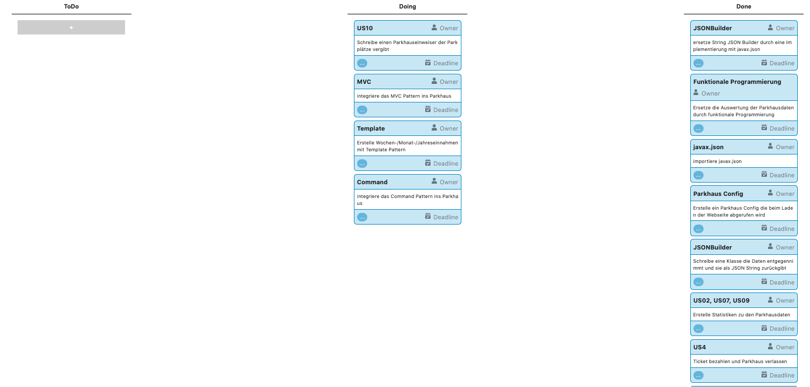
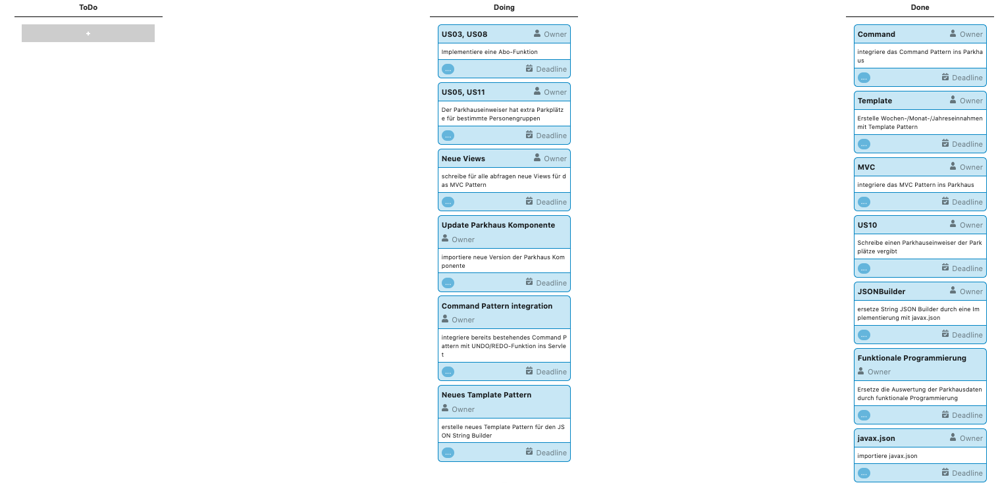
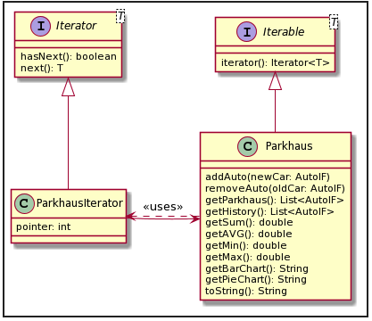

# SS20 TEAM 3
## Felix Knorre, MatrNr: 9030916
---

- [Digitalisierungskonzept](#digitalisierungskonzept)
- [User Stories](#user-stories)
- [Kanban-Board](#kanban-board)
  * [Sprint 1](#sprint-1)
  * [Sprint 2](#sprint-2)
  * [Sprint 3](#sprint-3)
  * [Sprint 4](#sprint-4)
  * [Sprint 5](#sprint-5)
- [Priorisierung der User Stories](#priorisierung-der-user-stories)
- [Minimum Viable Product (MVP)](#minimum-viable-product--mvp-)
- [UML Use Case-Diagramm](#uml-use-case-diagramm)
- [Robustheitsdiagramm](#robustheitsdiagramm)
- [UML Klassendiagramme](#uml-klassendiagramme)
  * [Anforderungskatalog nach Balzert](#anforderungskatalog-nach-balzert)
  * [Iterator Pattern](#iterator-pattern)
  * [Template Pattern](#template-pattern)
  * [Command Pattern](#command-pattern)
- [UML Sequenzdiagramme](#uml-sequenzdiagramme)
  * [Use Case: Statistiken einsehen](#use-case--statistiken-einsehen)
  * [Model View Controller (MVC)](#model-view-controller--mvc-)
- [UML Aktivitätsdiagramme](#uml-aktivit-tsdiagramme)
- [UML Verteilungsdiagramm](#uml-verteilungsdiagramm)
- [Verzeichnis der eingesetzten Patterns](#verzeichnis-der-eingesetzten-patterns)
  * [Iterator Pattern](#iterator-pattern-1)
  * [Template Pattern](#template-pattern-1)
  * [Model View Controller (MVC)](#model-view-controller--mvc--1)
  * [Command Pattern](#command-pattern-1)
- [Zielkonflikte](#zielkonflikte)
- [Iterationsbericht](#iterationsbericht)
  * [Iteration 1 (Woche 3-4)](#iteration-1--woche-3-4-)
  * [Iteration 2 (Woche 5-6)](#iteration-2--woche-5-6-)
  * [Iteration 3 (Woche 7-8)](#iteration-3--woche-7-8-)
  * [Iteration 4 (Woche 9-10)](#iteration-4--woche-9-10-)
  * [Iteration 5 (zwei Wochen in vorlesungsfreier Zeit)](#iteration-5--zwei-wochen-in-vorlesungsfreier-zeit-)
- [Summarisches Projektprotokoll](#summarisches-projektprotokoll)
  * [PT von Felix Knorre, 9030916:](#pt-von-felix-knorre--9030916-)
- [Resumée und Fazit](#resum-e-und-fazit)
  * [Was lief gut? Was hat sich bewährt? Was waren Erfolgsrezepte?](#was-lief-gut--was-hat-sich-bew-hrt--was-waren-erfolgsrezepte-)
  * [Was lief schlecht? Was würde man anders machen, wenn man noch einmal neu anfangen könnte? Also was hat man daraus gelernt und was würde man im nächsten Projekt besser machen?](#was-lief-schlecht--was-w-rde-man-anders-machen--wenn-man-noch-einmal-neu-anfangen-k-nnte--also-was-hat-man-daraus-gelernt-und-was-w-rde-man-im-n-chsten-projekt-besser-machen-)
- [Präsentation und Demo des Projekts](#pr-sentation-und-demo-des-projekts)

<small><i><a href='http://ecotrust-canada.github.io/markdown-toc/'>Table of contents generated with markdown-toc</a></i></small>

## Digitalisierungskonzept
---

Die Aufgabe des Semesterprojekt ist Digitalisierung eines Parkhauses. Das Projekt soll in einem Team in 10 Wochen in 4 Scrum Sprints umgesetzt werden. Es soll ein Parkhaus simuliert werden. Die Parkhauskunden sollen ein Ticket ziehen können, mit ihrem Auto in das Parkhaus fahren können, das Ticket wieder bezahlen können und das Parkhaus wieder verlassen können. Kunden sollen ein Dauerkarte kaufen können. Der Parkhausbetreiber und Parkhausmitarbeiter sollen einen Überblick über die Parkhaussituation (freie, belegte Parkplätze) haben. Der Parkhausbetreiber und Investoren sollen außerdem Statistiken über das Parkverhalten der Kunden erhalten. Das Finanzamt erhält Informationen über die Umsätze.

**Autorenschaft:** Kai Klemmer, Tobias Krieger, Felix Knorre

## User Stories
---
* US01: Als Autofahrer ziehe ich bei der Einfahrt einen Parkschein, um in das Parkhaus hinein fahren zu können.
* US02: Als Betreiber des Parkhauses erstelle ich mit dem System Statistiken über die eingenommenen Gebühren, um eine Übersicht zu bekommen und Gewinn und Umsatz berechnen zu können.
* US03: Als Abonnent des Parkhauses ziehe ich am Automaten einen Monatsaboticket, um einen ganzen Monat ohne Parkschein in das Parkhaus hinein fahren zu können.
* US04: Als Autofahrer möchte ich mein Parkschein bezahlen können, um aus dem Parkhaus wieder hinaus zufahren zu können.
* US05: Als Familie möchte ich einen Parkschein lösen, ins Parkhaus auf einen Familienparkplatz zufahren und nach meiner Parkdauer den Parkschein zu bezahlen um das Parkhaus wieder zu verlassen.
* US06: Als Mitarbeiter des Finanzamts möchte ich in die Umsätze des Parkhauses einsehen können um zu verifizieren, dass der Parkhausbetreiber seine Steuererklärung richtig gemacht hat.
* US07: Als Inverstor möchte ich auf der Parkhausseite, die Statistiken der letzten Monate abrufen um ggf. das Investment zu bewerten.
* US08: Als Firmenkunde möchte ich Parkplätze mieten können, um meine Firmenfahrzeuge dauerhaft abzustellen.
* US09: Als Parkhausbetreiber möchte ich statistische Zahlen abrufen um zu schauen ob das Parkhaus optimal ausgelastet ist.
* US10: Als Mitarbeiter des Parkhauses möchte ich zu jedem Zeitpunkt eine konkrete Übersicht über die momentan belegten Parkplätze haben, um Kunden auf eventuell freie Parkplätze hinweisen zu können.
* US11: Als Person mit Behinderung benötige ich breite Parkplätze, um einfacher aussteigen zu können.
* US12: Als Parkhausbetreiber benötige ich ein System, dass die Zeit jedes Parkhauskunden misst, um für jeden Parkhauskunden einen Preis zu berechnen.

**Autorenschaft:** Kai Klemmer, Tobias Krieger, Felix Knorre

## Kanban-Board

### Sprint 1

### Sprint 2

### Sprint 3

### Sprint 4

### Sprint 5

**Autorenschaft:** Felix Knorre

## Priorisierung der User Stories

Nach dem alle User-Stories gesammelt wurden, werden diese mit Agile-Estimating bewertet. Es gibt einmal die Value Points, die den Mehrwert für das Produkt beschreiben und es gibt die Story-Points, die den Aufwand beschreiben. Als Werte nutzt man Zahlen der Fibonacci-Folge. Hat man die Wertevergabe durchgeführt, bildet man den Quotienten Mehrwert pro Aufwand (Value Points / Story Points). Durch den Quotienten ergibt sich eine Priorisierung der User Stories.

**Autorenschaft:** Kai Klemmer, Tobias Krieger, Felix Knorre

## Minimum Viable Product (MVP)

Nachdem man eine Priorisierung der User Stories vorgenommen hat, kann man das Minimim Viable Produkt bestimmten. Unter Berücksichtigung der Abhänigkeiten von bestimmten User-Stories und dem Quotienten Mehrwert pro Aufwand bildet man eine neue Liste, die die User-Stories enthält die mit minimalem Aufwand den wertvollsten Kundenbedraft decken. \
\
In dem Parkhausprojekt ergab sich so folgende Liste:
  
Hierbei gibt es die Abhänigkeit, Zeitmessung vot Ticket bezahlen und Parkhaus betreten vor Ticket zahlen.

**Autorenschaft:** Kai Klemmer, Tobias Krieger, Felix Knorre

## UML Use Case-Diagramm

**Autorenschaft:** Kai Klemmer, Tobias Krieger, Felix Knorre

## Robustheitsdiagramm

**Autorenschaft:** Kai Klemmer, Tobias Krieger, Felix Knorre

## UML Klassendiagramme
--- 
### Anforderungskatalog nach Balzert
Das Parkhaus beinhaltet Parkplätze. Ein Parkhaus hat einen Standort, einen Namen und eine Anzahl an Parkplätzen.

Ein Customer hat eine ID zur indentifikation, einen Namen. Zudem kann ein Customer ein Ticket ziehen, Ticket bezahlen.

Ein Investor hat eine ID und einen Namen, er kann Statistiken einsehen.

Parkhausbetreiber hat eine ID und einen Namen, er kann Statistiken einsehen und abfragen, so wie die Belegung betrachten.

Ein Mitarbeiter hat eine ID und einen Namen und kann die Belegung abfragen.

Ein Ticket hat eine ID und einen Timer zudem ist das Ticket mit zwei Zeiten ausgesattet. 

Die erste Zeit behinhaltet den Zeitpunkt vom ziehen des Tickets und der zweite Zeitpunkt behinhaltet den Zeitpunkt des bezahlens.Ein Ticket wird validiert.

Das Auto hat ein Nummernschild und eine Farbe, zudem wird es einem Customer zugewiesen.

Bei betrachten der Klasse Customer Investor Parkhausbetreiber und Mitarbeiter fällt auf das diese Redunate Attribute beinhalten und diese in eine Oberklasse Mensch augelagert werden können.

Wenn ein Ticket gezogen wird, wird ein Ticket erstellt. Dies Ticket bekommt die aktuelle Zeit übergeben. Wird das Ticket bezahlt bekommt das Ticket den Bezahlzeitpunkt als zweite Zeiteinheit. Wird ein Ticket validiert wird, wird geprüft ob dieses Ticket bezahlt wurde und zu welcher Zeit es bezahlt wurde.

Wenn die Belegung abgefragt wird, wird die Anzahl der Belgeten Parkplätze überprüft.
Um Subsysteme zu bilden haben wir zu wenige Klasse.

**Autorenschaft:** Kai Klemmer, Tobias Krieger, Felix Knorre

### Iterator Pattern

**Autorenschaft:** Felix Knorre

### Template Pattern

**Autorenschaft:** Felix Knorre

### Command Pattern

**Autorenschaft:** Felix Knorre

## UML Sequenzdiagramme

### Use Case: Statistiken einsehen

**Autorenschaft:** Kai Klemmer, Tobias Krieger, Felix Knorre

### Model View Controller (MVC)

**Autorenschaft:** Felix Knorre

## UML Aktivitätsdiagramme

**Autorenschaft:** Kai Klemmer, Tobias Krieger, Felix Knorre

## UML Verteilungsdiagramm

**Autorenschaft:** Felix Knorre

## Verzeichnis der eingesetzten Patterns

### Iterator Pattern
* Iterator \<E>
* ParkhausIterator 
* Iterable \<E> 
* Parkhaus

### Template Pattern
* ChartJSONBuilder (Abstrakte Klasse)
* BarChartJSONBuilder (Konkrete Klasse)
* PieChartJSONBuilder (Konkrete Klasse)

### Model View Controller (MVC)
* Model
    * ParkhausIF
    * Parkhaus
* View
    * AVGView
    * BarChartView
    * HistoryTableView
    * MinMaxView
    * ParkhausView
    * PieChartView
    * SummenView
* Controller
    * ParkhausControllerIF
    * ParkhausController

### Command Pattern
* ParkhausCallerIF
* ParkhausCaller
* CommandIF
* AddAutoCommand
* RemoveAutoCommand

**Autorenschaft:** Felix Knorre
    
## Zielkonflikte

Haben Sie Zielkonflikte erkennen können? Wie haben Sie diese aufgelöst?

Während des Semesterprojektes sind keine Zielkonfilikte ausgetreten.

**Autorenschaft:** Felix Knorre

## Iterationsbericht

Was wurde in den vier Iterationen geleistet? Welche User Stories (Slice aus der Story Map) wurden in welcher Iteration jeweils umgesetzt? Was waren die Zwischenergebnisse? (Iterationsbericht z.B. mittels Screenshots des Kanban-Boards)

### Iteration 1 (Woche 3-4)
* Sprint Backlog
    * User Stories
        * US01: Als Autofahrer ziehe ich bei der Einfahrt einen Parkschein, um in das Parkhaus hinein fahren zu können.
        * US04: Als Autofahrer möchte ich mein Parkschein bezahlen können, um aus dem Parkhaus wieder hinaus zufahren zu können.
        * US12: Als Parkhausbetreiber benötige ich ein System, dass die Zeit jedes Parkhauskunden misst, um für jeden Parkhauskunden einen Preis zu berechnen.
        * US06: Als Mitarbeiter des Finanzamts möchte ich in die Umsätze des Parkhauses einsehen können um zu verifizieren, dass der Parkhausbetreiber seine Steuererklärung richtig gemacht hat.
    * Tasks
        * IDE, git, VPN einrichten
        * Projekt Setup, Parkhaus-Komponente importieren 
        * bereits geschriebene Auto, Parkhaus Klassen mit Test importieren
        * SUM/AVG/Min/Max Button
        * MVP implementieren
### Iteration 2 (Woche 5-6)
* Sprint Backlog
    * User Stories
        * US02: Als Betreiber des Parkhauses erstelle ich mit dem System Statistiken über die eingenommenen Gebühren, um eine Übersicht zu bekommen und Gewinn und Umsatz berechnen zu können.
        * US07: Als Inverstor möchte ich auf der Parkhausseite, die Statistiken der letzten Monate abrufen um ggf. das Investment zu bewerten.
        * US09: Als Parkhausbetreiber möchte ich statistische Zahlen abrufen um zu schauen ob das Parkhaus optimal ausgelastet ist.
    * Tasks
        * Parkhaus Config vom Server beim Seitenladen
        * Klasse zum JSON String erzeugen
### Iteration 3 (Woche 7-8)
* Sprint Backlog
    * User Stories
    * Tasks
        * Bisherige Auswertung der Parkhausdaten durch funktionale Programmierung ersetzen
        * importiere javax.json ins Projekt
        * Ersetze JSON String Builder und erzeuge JSON String mit javax.json
### Iteration 4 (Woche 9-10)
* Sprint Backlog
    * User Stories
        * US10: Als Mitarbeiter des Parkhauses möchte ich zu jedem Zeitpunkt eine konkrete Übersicht über die momentan belegten Parkplätze haben, um Kunden auf eventuell freie Parkplätze hinweisen zu können.
    * Tasks
        * implementiere MVC Pattern
        * implementiere Template Pattern (Wochen-/Monat-/Jahreseinnahmen)
        * implementiere Command Pattern 
### Iteration 5 (zwei Wochen in vorlesungsfreier Zeit)
* Sprint Backlog
    * User Stories
        * US03: Als Abonnent des Parkhauses ziehe ich am Automaten einen Monatsaboticket, um einen ganzen Monat ohne Parkschein in das Parkhaus hinein fahren zu können.
        * US05: Als Familie möchte ich einen Parkschein lösen, ins Parkhaus auf einen Familienparkplatz zufahren und nach meiner Parkdauer den Parkschein zu bezahlen um das Parkhaus wieder zu verlassen.
        * US08: Als Firmenkunde möchte ich Parkplätze mieten können, um meine Firmenfahrzeuge dauerhaft abzustellen.
        * US11: Als Person mit Behinderung benötige ich breite Parkplätze, um einfacher aussteigen zu können.
    * Tasks
        * neue Parkhaus Komponenten Version importieren
        * Tabelle der Parkhaus Komponenten ausblenden und eigene Tabelle anlegen
        * MVC: neue Views hinzufügen
        * UNDO/REDO-Funktion im Servlet integrieren
        * neuer Parkeinweiser
        * bisheriges Template Pattern entfernt und neues Template Pattern(JSON Builder)

**Autorenschaft:** Felix Knorre

## Summarisches Projektprotokoll

Wie viel Zeit (in Personentagen (PT)) ist in welche Arbeit, in welche Teilschritte, in welche Zwischenergebnisse hinein geflossen?

### PT von Felix Knorre, 9030916:

| Iteration | Zeit(PT) | 
|-----------|----------|
| 1         | 4        |
| 2         | 4        |
| 3         | 5        |
| 4         | 4        |
| 5         | 6        |

**Autorenschaft:** Felix Knorre

## Resumée und Fazit

### Was lief gut? Was hat sich bewährt? Was waren Erfolgsrezepte?

* Die Aufteilung der User Stories und der Task auf die Srum Sprint hat sehr gut funktioniert. Ein Scrum Sprint dauerte zwei Wochen, was zeitlich gut passte und sich die User Stories und Task in der Zeit auch abarbeiten ließen. 

* Der Test-Driven-Development Ansatz hat sich bewährt. Das Schreiben von Tests hat zwar im Vor­hi­n­ein mehr Zeit gekostet, aber man hat sich bevor man den eigentlichen Code schreibt gedanken gemacht was man überhaupt brauch und wenn man in einem nachfolgendem Srum Sprint etwas anpassen musste, könnte man so gewährleisten das der Code noch das gewollte Ergebnis liefer

### Was lief schlecht? Was würde man anders machen, wenn man noch einmal neu anfangen könnte? Also was hat man daraus gelernt und was würde man im nächsten Projekt besser machen? 

* Das Team bestand anfangs aus drei Personen und wir haben auch Produkt Vision, MVP, die UML Diagramme, etc. (siehe Liste mit Eigenleistungen) zusammen erarbeitet. Doch das Semester Projekt wurde ausschließlich von mir(Felix Knorre) alleine implementiert. Man muss an dieser Stelle sagen, dass hier keine einzelne Person daran Schuld ist. Wir haben darüber gesprochen, um herauszufinden, was schiefgelaufen ist, wie es zu dieser Situation kam und wir stellten fest, dass wir alle unterschiedliche Voraussetzungen zum Beginn des Projektes mitbrachten. Wir hatten dann die Wahl das Team aufzulösen oder die anderen Teammitglieder versuchen aufzuholen und ich stelle meine Commits ein. Wir haben uns im Guten dazu entschlossen das Team aufzulösen, da das Projekt zu dem Zeitpunkt schon weit fortgeschritten war und so jedes Teammitglied die Möglichkeit hat mit seinem eigenem Projekt zu zeigen was er in diesem Semester über Software Engineering gelernt hat. Wir haben daraus gelernt und wenn wir das Projekt noch einmal neu anfangen könnten, würden wir dafür sorgen, dass wir nicht noch einmal die diese Situation kommt, jeder 1/3 des Codes schreibt, um so die Softwareentwicklung im Team zu üben.

**Autorenschaft:** Felix Knorre

## Präsentation und Demo des Projekts
[Präsentation](https://www.google.de)\
[Demo Video](https://www.google.de)\
[Live Demo](http://sepp-test.inf.h-brs.de:8080/mk_se1_ss20_team3/)

**Autorenschaft:** Felix Knorre
