# SS20 TEAM 3
## Felix Knorre, MatrNr: 9030916
---

## Digitalisierungskonzept
---

Die Aufgabe des Semesterprojekt ist Digitalisierung eines Parkhauses. Das Projekt soll in einem Team in 10 Wochen in 4 Scrum Sprints umgesetzt werden. Es soll ein Parkhaus simuliert werden. Die Parkhauskunden sollen ein Ticket ziehen können, mit ihrem Auto in das Parkhaus fahren können, das Ticket wieder bezahlen können und das Parkhaus wieder verlassen können. Kunden sollen ein Dauerkarte kaufen können. Der Parkhausbetreiber und Parkhausmitarbeiter sollen einen Überblick über die Parkhaussituation (freie, belegte Parkplätze) haben. Der Parkhausbetreiber und Investoren sollen außerdem Statistiken über das Parkverhalten der Kunden erhalten. Das Finanzamt erhält Informationen über die Umsätze.

**Autor:** Kai Klemmer, Tobias Krieger, Felix Knorre

## User Stories
---
* US01: Als Autofahrer ziehe ich bei der Einfahrt einen Parkschein, um in das Parkhaus hinein fahren zu können.
* US02: Als Betreiber des Parkhauses erstelle ich mit dem System Statistiken über die eingenommenen Gebühren, um eine Übersicht zu bekommen und Gewinn und Umsatz berechnen zu können.
* US03: Als Abonnent des Parkhauses ziehe ich am Automaten einen Monatsaboticket, um einen ganzen Monat ohne Parkschein in das Parkhaus hinein fahren zu können.
* US04: Als Autofahrer möchte ich mein Parkschein bezahlen können, um aus dem Parkhaus wieder hinaus zufahren zu können.
* US05: Als Familie möchte ich einen Parkschein lösen, ins Parkhaus auf einen Familienparkplatz zufahren und nach meiner Parkdauer den Parkschein zu bezahlen um das Parkhaus wieder zu verlassen.
* US06: Als Mitarbeiter des Finanzamts möchte ich in die Umsätze des Parkhauses einsehen können um zu verifizieren, dass der Parkhausbetreiber seine Steuererklärung richtig gemacht hat.
* US07: Als Inverstor möchte ich auf der Parkhausseite, die Statistiken der letzten Monate abrufen um ggf. das Investment zu bewerten.
* US08: Als Firmenkunde möchte ich Parkplätze mieten können, um meine Firmenfahrzeuge dauerhaft abzustellen.
* US09: Als Parkhausbetreiber möchte ich statistische Zahlen abrufen um zu schauen ob das Parkhaus optimal ausgelastet ist.
* US10: Als Mitarbeiter des Parkhauses möchte ich zu jedem Zeitpunkt eine konkrete Übersicht über die momentan belegten Parkplätze haben, um Kunden auf eventuell freie Parkplätze hinweisen zu können.
* US11: Als Person mit Behinderung benötige ich breite Parkplätze, um einfacher aussteigen zu können.
* US12: Als Parkhausbetreiber benötige ich ein System, dass die Zeit jedes Parkhauskunden misst, um für jeden Parkhauskunden einen Preis zu berechnen.

**Autor:** Kai Klemmer, Tobias Krieger, Felix Knorre

## Kanban-Board

**Autor:** Felix Knorre

## Priorisierung der User Stories

Nach dem alle User-Stories gesammelt wurden, werden diese mit Agile-Estimating bewertet. Es gibt einmal die Value Points, die den Mehrwert für das Produkt beschreiben und es gibt die Story-Points, die den Aufwand beschreiben. Als Werte nutzt man Zahlen der Fibonacci-Folge. Hat man die Wertevergabe durchgeführt, bildet man den Quotienten Mehrwert pro Aufwand (Value Points / Story Points). Durch den Quotienten ergibt sich eine Priorisierung der User Stories.

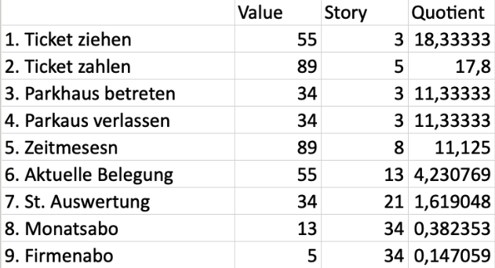

**Autor:** Kai Klemmer, Tobias Krieger, Felix Knorre

## Minimum Viable Product (MVP)

Nachdem man eine Priorisierung der User Stories vorgenommen hat, kann man das Minimim Viable Produkt bestimmten. Unter Berücksichtigung der Abhänigkeiten von bestimmten User-Stories und dem Quotienten Mehrwert pro Aufwand bildet man eine neue Liste, die die User-Stories enthält die mit minimalem Aufwand den wertvollsten Kundenbedraft decken. \
\
In dem Parkhausprojekt ergab sich so folgende Liste:
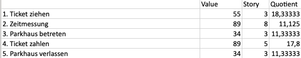  
Hierbei gibt es die Abhänigkeit, Zeitmessung vot Ticket bezahlen und Parkhaus betreten vor Ticket zahlen.

**Autor:** Kai Klemmer, Tobias Krieger, Felix Knorre

## UML Use Case-Diagramm

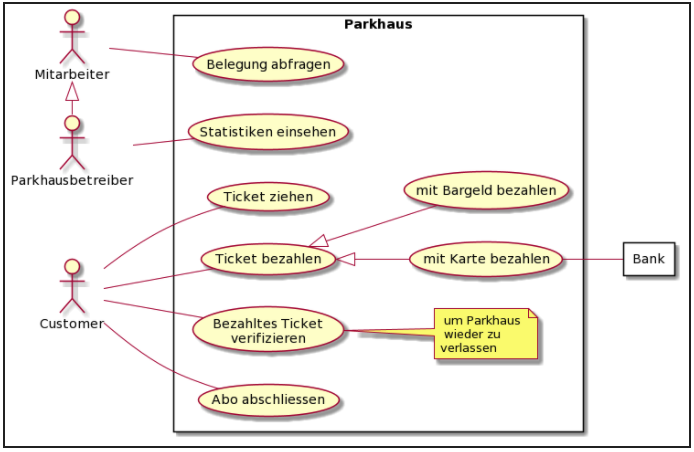

**Autor:** Kai Klemmer, Tobias Krieger, Felix Knorre

## Robustheitsdiagramm

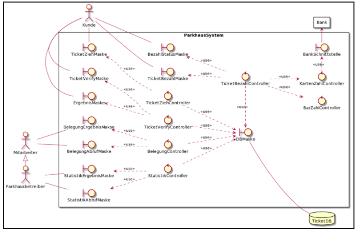

**Autor:** Kai Klemmer, Tobias Krieger, Felix Knorre

## UML Klassendiagramme
--- 
### Anforderungskatalog nach Balzert
Das Parkhaus beinhaltet Parkplätze. Ein Parkhaus hat einen Standort, einen Namen und eine Anzahl an Parkplätzen.

Ein Customer hat eine ID zur indentifikation, einen Namen. Zudem kann ein Customer ein Ticket ziehen, Ticket bezahlen.

Ein Investor hat eine ID und einen Namen, er kann Statistiken einsehen.

Parkhausbetreiber hat eine ID und einen Namen, er kann Statistiken einsehen und abfragen, so wie die Belegung betrachten.

Ein Mitarbeiter hat eine ID und einen Namen und kann die Belegung abfragen.

Ein Ticket hat eine ID und einen Timer zudem ist das Ticket mit zwei Zeiten ausgesattet. 

Die erste Zeit behinhaltet den Zeitpunkt vom ziehen des Tickets und der zweite Zeitpunkt behinhaltet den Zeitpunkt des bezahlens.Ein Ticket wird validiert.

Das Auto hat ein Nummernschild und eine Farbe, zudem wird es einem Customer zugewiesen.

Bei betrachten der Klasse Customer Investor Parkhausbetreiber und Mitarbeiter fällt auf das diese Redunate Attribute beinhalten und diese in eine Oberklasse Mensch augelagert werden können.

Wenn ein Ticket gezogen wird, wird ein Ticket erstellt. Dies Ticket bekommt die aktuelle Zeit übergeben. Wird das Ticket bezahlt bekommt das Ticket den Bezahlzeitpunkt als zweite Zeiteinheit. Wird ein Ticket validiert wird, wird geprüft ob dieses Ticket bezahlt wurde und zu welcher Zeit es bezahlt wurde.

Wenn die Belegung abgefragt wird, wird die Anzahl der Belgeten Parkplätze überprüft.
Um Subsysteme zu bilden haben wir zu wenige Klasse.

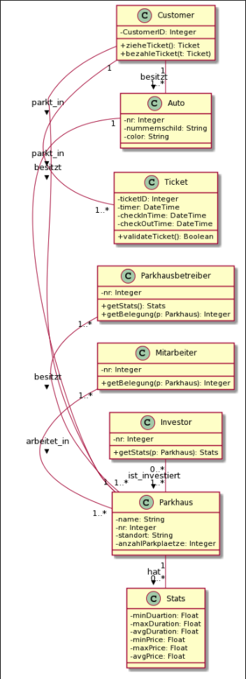

**Autor:** Kai Klemmer, Tobias Krieger, Felix Knorre

### Iterator Pattern

**Autor:** Felix Knorre

### Template Pattern

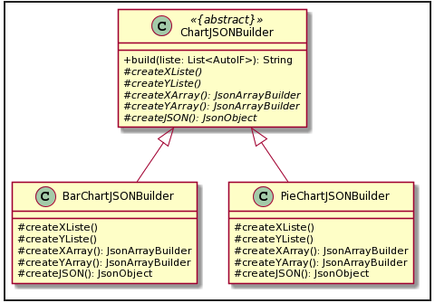

**Autor:** Felix Knorre

### Command Pattern

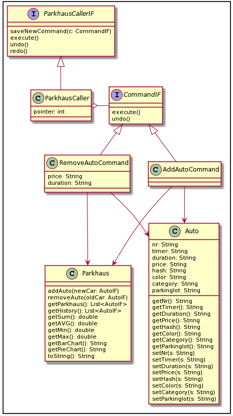

**Autor:** Felix Knorre

## UML Sequenzdiagramme

### Use Case: Statistiken einsehen

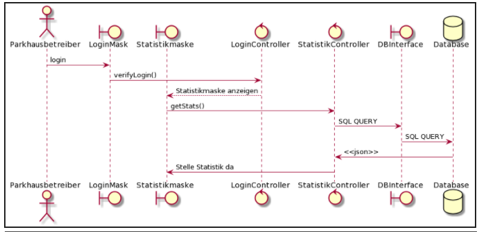

**Autor:** Kai Klemmer, Tobias Krieger, Felix Knorre

### Model View Controller (MVC)

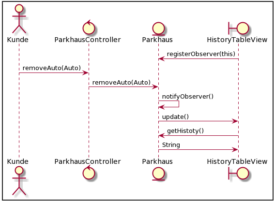

**Autor:** Felix Knorre

## UML Aktivitätsdiagramme

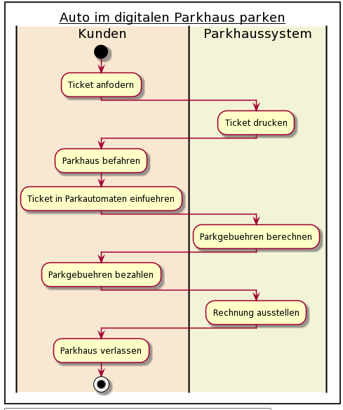

**Autor:** Kai Klemmer, Tobias Krieger, Felix Knorre

## UML Verteilungsdiagramm

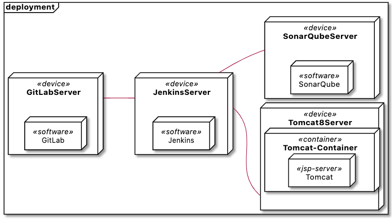

**Autor:** Felix Knorre

## Verzeichnis der eingesetzten Patterns

### Iterator Pattern
* Iterator \<E>
* ParkhausIterator 
* Iterable \<E> 
* Parkhaus

### Template Pattern
* ChartJSONBuilder (Abstrakte Klasse)
* BarChartJSONBuilder (Konkrete Klasse)
* PieChartJSONBuilder (Konkrete Klasse)

### Model View Controller (MVC)
* Model
    * ParkhausIF
    * Parkhaus
* View
    * AVGView
    * BarChartView
    * HistoryTableView
    * MinMaxView
    * ParkhausView
    * PieChartView
    * SummenView
* Controller
    * ParkhausControllerIF
    * ParkhausController

### Command Pattern
* ParkhausCallerIF
* ParkhausCaller
* CommandIF
* AddAutoCommand
* RemoveAutoCommand
    
## Zielkonflikte

## Iterationsbericht

### Iteration 1 (Woche 3-4)
### Iteration 2 (Woche 5-6)
### Iteration 3 (Woche 7-8)
### Iteration 4 (Woche 9-10)
### Iteration 1 (zwei Wochen in vorlesungsfreier Zeit)

## Summarisches Projektprotokoll

## Resumée und Fazit

## Präsentation und Demo des Projekts
[Präsentation](https://www.google.de)\
[Demo Video](https://www.google.de)\
[Live Demo](http://sepp-test.inf.h-brs.de:8080/mk_se1_ss20_team3/)
